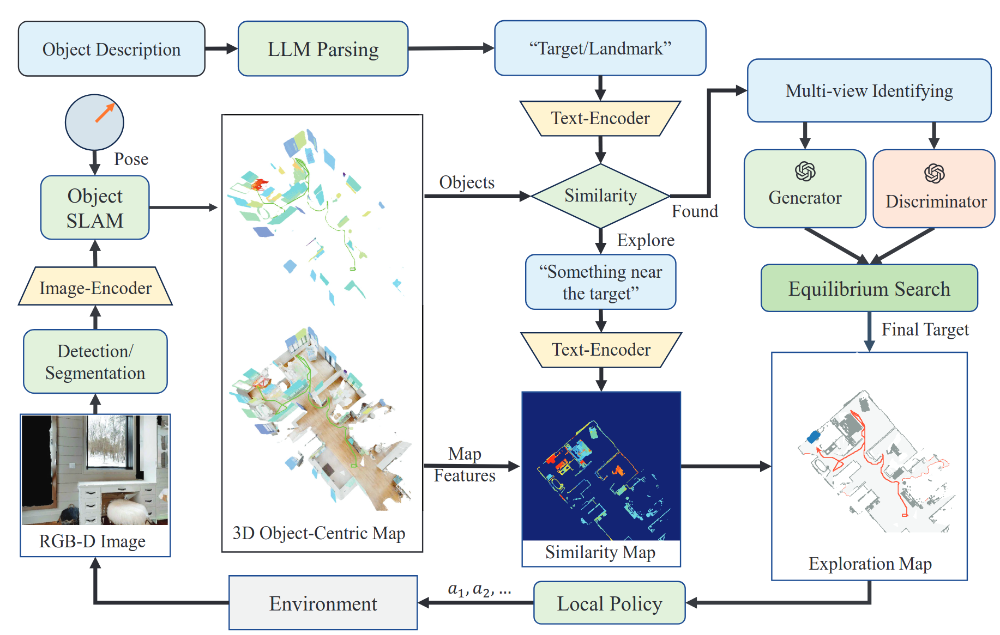

# VLN-Game: Vision-Language Equilibrium Search for Zero-Shot Semantic Navigation

[**Project Page**](https://sites.google.com/view/vln-game) |[**ArXiv**](https://arxiv.org/pdf/2411.11609) |[**Video**](https://youtu.be/YgkyYVy6tX8)

We proposed a new framework to explore and search for the language descriptive targets in unknown environment based on Large Vision Language Model. Our work is based on [Concept-Graph](https://github.com/concept-graphs/concept-graphs?tab=readme-ov-file) and [L3MVN](https://sites.google.com/view/l3mvn), implemented in PyTorch. Part of this work was conducted during the first author’s internship at Tencent Robotics X.

**Author:** Bangguo Yu<sup>1, 2</sup>, Yuzhen Liu<sup>1</sup><sup>†</sup>, Lei Han<sup>1</sup>, Hamidreza Kasaei<sup>2</sup><sup>†</sup>, Tingguang Li<sup>1</sup><sup>†</sup>, and Ming Cao<sup>2</sup>

**Affiliation:** <sup>1</sup>Tencent Robotics X     <sup>2</sup>University of Groningen


## Abstract

Following human instructions to explore and search for a specified target in an unfamiliar environment is a crucial skill for mobile service robots. Most of the previous works on object goal navigation have typically focused on a single input modality as the target, which may lead to limited consideration of language descriptions containing detailed attributes and spatial relationships. To address this limitation, we propose VLN-Game, a novel zero-shot framework for visual target navigation that can process object names and descriptive language targets effectively. To be more precise, our approach constructs a 3D object-centric spatial map by integrating pre-trained visual-language features with a 3D reconstruction of the physical environment. Then, the framework identifies the most promising areas to explore in search of potential target candidates. A game-theoretic vision-language model is employed to determine which target best matches the given language description. Experiments conducted on the Habitat-Matterport 3D (HM3D) dataset demonstrate that the proposed framework achieves state-of-the-art performance in both object goal navigation and language-based navigation tasks. Moreover, we show that VLN-Game can be easily deployed on real-world robots. The success of VLN-Game highlights the promising potential of using game-theoretic methods with compact vision-language models to advance decision-making capabilities in robotic systems.




## Installation

The code has been tested only with Python 3.10, CUDA 12.1. We also provide docker containers to run the Object-Goal Navigation task, or install all the packages manually to run all tasks.

### Installing Dependencies
- Setup the conda environment as Python3.10 + CUDA12.1 + PyTorch2.1.0.
    ```
    conda create -n vlmgame anaconda python=3.10
    conda activate vlmgame
    pip install torch==2.1.0 torchvision==0.16.0 torchaudio==2.1.0 --index-url https://download.pytorch.org/whl/cu121
    ```
- We use 0.2.1 versions of [habitat-sim](https://github.com/facebookresearch/habitat-sim) and [habitat-lab](https://github.com/facebookresearch/habitat-lab) as specified below:

- Installing habitat-sim:
    ```
    git clone https://github.com/facebookresearch/habitat-sim.git
    cd habitat-sim; git checkout tags/v0.2.1; 
    pip install -r requirements.txt; 
    python setup.py install --headless
    python setup.py install # (for Mac OS)
    ```

- Installing habitat-lab:
    ```
    git clone https://github.com/facebookresearch/habitat-lab.git
    cd habitat-lab; git checkout tags/v0.2.1; 
    pip install -e .
    ```

- Install Open3D for visualization: 

    ```
    pip install "git+https://github.com/facebookresearch/pytorch3d.git@stable"
    ```

- Install [Ground-SAM](https://github.com/IDEA-Research/Grounded-Segment-Anything):
    ```
    # Grounded-SAM
    export AM_I_DOCKER=False
    export BUILD_WITH_CUDA=True
    export CUDA_HOME=/path/to/anaconda3/envs/vlmgame/ #if you use the cluster to load the CUDA, you can check the path by "module show CUDAxxx"

    git clone git@github.com:IDEA-Research/Grounded-Segment-Anything.git
    cd Grounded-Segment-Anything
    python -m pip install -e segment_anything
    python -m pip install -e GroundingDINO # delete pyproject.toml if building failure due to the cuda verson mismatch (link: https://github.com/vllm-project/vllm/issues/129#issuecomment-1805088950)

    #download
    wget https://dl.fbaipublicfiles.com/segment_anything/sam_vit_h_4b8939.pth
    wget https://github.com/IDEA-Research/GroundingDINO/releases/download/v0.1.0-alpha/groundingdino_swint_ogc.pth

    ```

- Clone the repository and install other requirements:
    ```
    git clone https://github.com/ybgdgh/VLN-Game
    cd VLM-Game
    pip install -r requirements.txt
    ```


### Prepare Datasets

Create a `data` folder in `VLM-Game` path
```
mkdir data
cd data
```

#### Habitat Matterport
Download [HM3D_v0.1](https://aihabitat.org/datasets/hm3d/) dataset using download utility and [instructions](https://github.com/facebookresearch/habitat-sim/blob/main/DATASETS.md#habitat-matterport-3d-research-dataset-hm3d):
```
python -m habitat_sim.utils.datasets_download --username <api-token-id> --password <api-token-secret> --uids hm3d_val_habitat
```

#### Download Language description datasets

Download the [vlobjectnav_hm3d](https://drive.google.com/file/d/1fhXwBuGUOhF2jjW0ThtE_6rh_P3YQClj/view?usp=sharing) and unzip it in data/datasets path.


#### Setting up datasets
The code requires the datasets in a `data` folder in the following format:
```
VLM-Game/
  data/
    scene_datasets/
    versioned_data/
    datasets/
        objectgoal_hm3d/
        vlobjectnav_hm3d/
```

The `objectgoal_hm3d` is used for object-goal navigation, and `vlobjectnav_hm3d` is used for language descriptive target navigation.


## Run VLM_Game: 

The following commands should be run in the conda environemnt:
```
export GSA_PATH=/path/to/Grounded-Segment-Anything
```

#### Object-goal navigation
For evaluating the object-goal navigation task, run:
```
python main_vis.py
```
For multiprocessing, run:
```
python main_vis_vec.py
```

You can also add `-v 1` to enable the Open3D visualization UI to check the maps, and `-n 1` to set the number of multiprocessing.


#### Language-goal navigation
For evaluating the language-goal navigation task, the OpenAI API should be set firstly in `arguments.py`, then run:
```
python main_vln.py
```
For multiprocessing, run:
```
python main_vln_vec.py
```


#### Docker Setup
We provide docker containers for object-goal navigation task. This works on machines with an NVIDIA GPU and requires users to install nvidia-docker. To setup the habitat stack using docker follow the below steps:

1. Install Docker and pull the vlmgame docker image:
    ```
    docker pull ybgsdu/vln_llmgame:objnav-yolo-stair
    ```
2. Install NVIDIA Container Toolkit
    ```
    # Set up the package repository and the GPG key:
    distribution=$(. /etc/os-release;echo $ID$VERSION_ID)
    curl -s -L https://nvidia.github.io/nvidia-docker/gpgkey | sudo apt-key add -
    curl -s -L https://nvidia.github.io/nvidia-docker/$distribution/nvidia-docker.list | sudo tee /etc/apt/sources.list.d/nvidia-docker.list

    #Install the NVIDIA Docker toolkit:
    sudo apt-get update
    sudo apt-get install -y nvidia-docker2

    #Restart the Docker daemon to load the changes:
    sudo systemctl restart docker
    ```
3. Mount the data into the docker when you run the docker
   ```
   sudo docker run --runtime=nvidia -e NVIDIA_DRIVER_CAPABILITIES=all  -e "DISPLAY=$DISPLAY" -v /tmp/.X11-unix:/tmp/.X11-unix -e LIBGL_ALWAYS_SOFTWARE=1 --net=host -it -v /path/to/data/:/root/VLN-GPT/data --gpus all ybgsdu/vln_llmgame:objnav-dino-stair /bin/bash -c "cd /root/VLN-GPT/ && ./setup_obj.sh 1 0"
    ```
    Make sure to adjust the last two parameters `1` and `0`  based on your own enrionment for the number of multiprocessing and the GPU_ID, respectively.

Since the language goal navigation relies on the rendering of Open3D, which can't run in this docker containers, we only run language goal navigation task locally.

## Citation
If you find this project helpful for your research, please consider citing the following BibTeX entry.
```
@article{yu2024vlngame,
  title={VLN-Game: Vision-Language Equilibrium Search for Zero-Shot Semantic Navigation}, 
  author={Bangguo Yu, Yuzhen Liu, Lei Han, Hamidreza Kasaei, Tingguang Li, and Ming Cao},
  journal={arXiv:2411.11609},
  year={2024}
}
```
